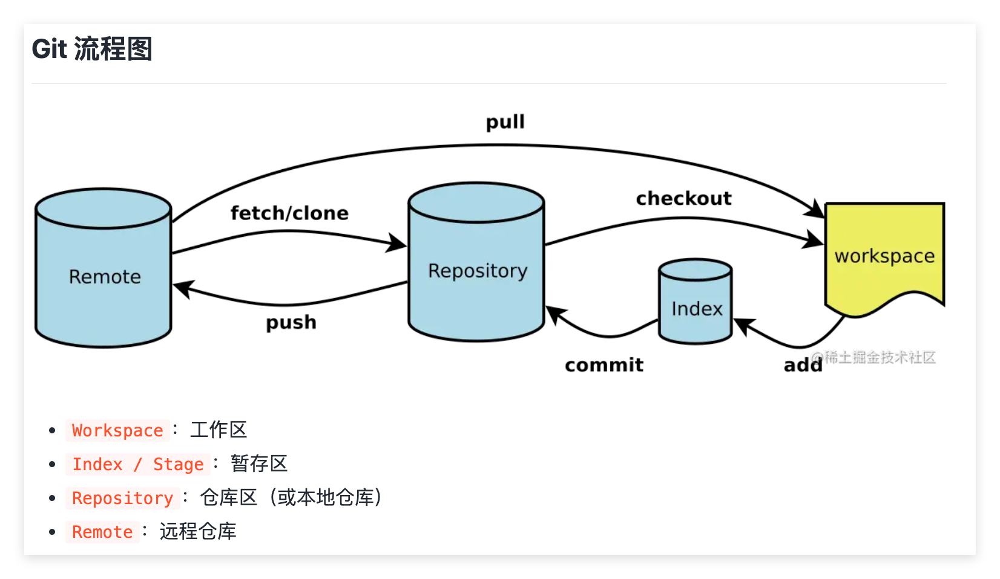

# 前端开发阶段总结（基于课程作业实践）

> 本文按课程作业的学习路径整理，重点记录：
> 1）知识点的介绍；
> 2）它与前后知识点的关系；
> 3）在本仓库作业中是否使用、如何使用；
> 4）在使用中遇到的问题以及解决方案。

---

## 一、前端开发基础与环境搭建

### 1. Git 基础使用、Git 版本控制

#### 1）是什么

Git 是分布式版本控制工具，用于记录代码历史、回退版本、管理分支。



#### 2）与上下文的关系

这是环境搭建和开发流程的起点。没有版本控制，后续迭代过程很难追踪。

#### 3）在作业中的使用

本仓库按 `week01 ~ week08` 组织代码，记录阶段功能提交。常用指令包括 `git add`, `git commit`, `git branch` 等。

#### 4）遇到的问题以及解决方案

- **.gitignore 失效**：先提交后加 ignore。解决：`git rm -r --cached .` 重新 add。
- **记录太碎**：解决：使用 `git commit --amend` 或合并分支时 squash。
- **误删远程文件**：本地删了 push 发现远程也没了。解决方案：通过 `git checkout [commit_id] -- [file_path]` 找回后重新提交。

---

### 2. 浏览器调试

#### 1）是什么

开发者工具（DevTools）提供了 Elements、Console、Network、Sources 等面板用于调试。

#### 2）与上下文的关系

它连接了"页面代码"和"运行结果"，是验证 HTML/CSS/JS 是否生效的最终环节。

#### 3）在作业中的使用

看 Network 面板定位接口失败、看 Elements 面板定位布局问题以及看 Console 定位运行时错误。

#### 4）遇到的问题以及解决方案

- **图片 404**：发现路径未映射。解决：在 Node.js 中配置静态资源转发。
- **状态更新滞后**：解决：在 Sources 打断点确认异步数据结构。

---

### 3. HTML

#### 1）是什么

HTML（HyperText Markup Language）是超文本标记语言，用于组织网页内容结构。

#### 2）与上下文的关系

HTML 提供结构，CSS 负责样式，JS 负责行为。三者是前端最基础的组合。

#### 3）在作业中的使用

- `week01` 灵犀项目中使用基础标签搭建聊天界面：

```html
<header id="chatHeader">
    
    <span>灵犀 AI</span>
</header>
```

#### 4）遇到的问题以及解决方案

- **表单刷新**：解决：`e.preventDefault()` 阻止默认行为。
- **标签闭合导致布局乱掉**：解决：开启编辑器插件（Prettier）自动纠错。

---

### 4. CSS

#### 1）是什么

CSS 控制布局、颜色、间距、状态反馈和视觉层级。

#### 2）与上下文的关系

有了 HTML 结构后，CSS 让页面"可读、可用、可维护"；进入 React 后，CSS 是组件视觉一致性的保障。

#### 3）在作业中的使用

- 使用 Flex 布局完成基础样式，并实现单行省略：

```tsx
style={{ maxWidth: '240px', overflow: 'hidden', textOverflow: 'ellipsis', whiteSpace: 'nowrap' }}
```

#### 4）遇到的问题以及解决方案

- **垂直居中难题**：解决：全面改用 Flexbox。
- **样式污染**：解决：使用 CSS Modules 或内联样式限制作用域。

---

### 5. JavaScript 编程基础

#### 1）是什么

JavaScript 负责页面逻辑与数据处理，包括变量、条件、循环、函数、对象数组操作等。

#### 2）与上下文的关系

它是 Web API、异步请求、框架开发的基础。没有 JS 基础，后续 React 和工程化很难深入。

#### 3）在作业中的使用

- 处理消息发送逻辑，并使用 `map` 渲染列表：

```tsx
{students.map((student) => <tr key={student.id}><td>{student.name}</td></tr>)}
```

#### 4）遇到的问题以及解决方案

- **浅拷贝坑**：解决：使用展开运算符 `{...oldObj}`。
- **this 指向**：解决：统一改用箭头函数。

---

### 6. Web APIs，DOM 和 BOM

#### 1）是什么

- **DOM**: 操作页面节点与事件。
- **BOM**: 浏览器对象模型（`window.location`、`localStorage` 等）。

#### 2）与上下文的关系

JS 语言本身不直接操作页面，DOM/BOM/Web APIs 提供了与浏览器环境交互的入口。

#### 3）在作业中的使用

- 使用 `localStorage` 维持 Token，使用 `window.location.href` 处理跳转。

#### 4）遇到的问题以及解决方案

- **Token 过期**：解决：在响应拦截器中捕获 401 并清空存储。

---

## 二、JavaScript 语言进阶和工程化

### 1. 异步编程和 Promise

#### 1）是什么

异步编程用于处理非阻塞操作，如网络请求。Promise 是其规范，`async/await` 是其终极语法糖。

#### 2）与上下文的关系

它是 HTTP 请求、实时通信的基础。React 页面加载、接口错误处理都依赖异步模型。

#### 3）在作业中的使用

API 调用统一使用 `async/await`：

```tsx
const res = await studentsApi.getStudents({ page, ...filters });
```

#### 4）遇到的问题以及解决方案

- **并发请求性能**：多个互不依赖的请求按顺序 await 导致加载慢。解决方案：改用 `Promise.all([p1, p2])` 并发执行，大幅缩短总耗时。

---

### 2. JS 对象、原型、设计模式

#### 1）是什么

- **原型/继承**: JS 的属性共享机制。
- **类 (Class)**: 封装数据和方法的语法。
- **设计模式**: 针对特定问题的通用方案（如单例、观察者）。

#### 2）与上下文的关系

从"写代码"到"写架构"的跨越。工程化阶段对代码组织要求更高。

#### 3）在作业中的使用

- 后端 `success/fail` 响应工具函数的封装体现了统一输出的设计。

#### 4）遇到的问题以及解决方案

- **重复代码太多**：每个接口都写同样的错误处理。解决方案：提取公共拦截逻辑到 API 基类或拦截器中。

---

### 3. 从 XMLHttpRequest 到 Fetch、SSE、WebSocket

#### 1）是什么

- **Fetch**: 现代 Promise 风格请求。
- **SSE (Server-Sent Events)**: 服务端向客户端单向推送文本流。
- **WebSocket**: 全双工长连接交互。

#### 2）与上下文的关系

这是通信能力升级的路径：从"一问一答"到"流式持续更新"。

#### 3）在作业中的使用

- 在 `week02` SSE 练习中发送实时消息：

```javascript
res.writeHead(200, { 'Content-Type': 'text/event-stream' });
res.write(`data: ${JSON.stringify({ text: 'chunk' })}\n\n`);
```

#### 4）遇到的问题以及解决方案

- **SSE 自动重连问题**：网络抖动导致连接断开。解决方案：利用 `EventSource` 自带的重连机制，并在后端配置合适的 `retry` 间隔。

---

### 4. Node.js

#### 1）是什么

Node.js 让 JS 运行在服务端，具备访问文件系统、数据库和网络的能力。

#### 2）与上下文的关系

Node.js 串联了全栈链路。通过写 Node.js，更深刻理解了 HTTP 请求的生命周期。

#### 3）在作业中的使用

`week03` 后端基于 Koa 框架，实现了 JWT 验证和数据库 CRUD：

```javascript
ctx.state.user = jwt.verify(token, JWT_SECRET);
```

#### 4）遇到的问题以及解决方案

- **中间件顺序问题**：权限验证放在了路由后面导致失效。解决方案：调整 `app.use` 顺序，确保 `authenticateToken` 中间件在业务路由之前执行。

---

### 5. Webpack 和 Vite

#### 1）是什么

- **Webpack**: 强大的打包器，适合复杂构建。
- **Vite**: 基于浏览器原生 ESM 的构建工具，开发效率极高。

#### 2）与上下文的关系

解决模块化开发到浏览器部署的转换。Vite 极速的热更新彻底改变了开发体验。

#### 3）在作业中的使用

- `week02` 练习 Webpack 配置，`week03` 全面改用 Vite 提升开发体验。

#### 4）遇到的问题以及解决方案

- **环境变量读取问题**：Vite 默认不读取 process.env。解决方案：使用 `import.meta.env` 并配置 `.env` 文件前缀为 `VITE_`。

---

### 6. TypeScript

#### 1）是什么

TS 是 JS 的超集，为变量提供显式类型定义，由微软开发维护。

#### 2）与上下文的关系

在大中型项目中，TS 是"文档"也是"护城河"，显著减少因字段错写导致的低级 Bug。

#### 3）在作业中的使用

定义 `Student`, `Course` 等 interface 约束 API 返回值：

```typescript
export interface Student { id: number; name: string; status: 'active' | 'inactive'; }
```

#### 4）遇到的问题以及解决方案

- **后端返回数据类型不匹配**：API 定义的 interface 与后端实际返回不符。解决方案：使用工具类 `ApiResponse<T>` 封装，并严格校验后端数据字典。

---

## 三、HTTP 入门和 React 开发

### 1. HTTP 原理与实践

#### 1）是什么

HTTP 是互联网通信基石。定义了语义化的方法（GET/POST 等）和标准状态码。

#### 2）与上下文的关系

它是前端向后端索取数据的"通用语言"。

#### 3）在作业中的使用

- `week03` 接口遵循 RESTful 风格，创建成功返回 201 状态码。

#### 4）遇到的问题以及解决方案

- **跨域问题 (CORS)**：本地测试连不上后端。解决方案：在 Vite 中配置 Proxy，通过本地同源请求转发绕过浏览器同源策略限制。

---

### 2. Whistle 和 Postman 使用

#### 1）是什么

- **Postman**: 接口调试神器。
- **Whistle**: 抓包代理工具。

#### 2）与上下文的关系

它们是调试 HTTP 的"显微镜"。

#### 3）在作业中的使用

- 在前端代码还没写好时，先用 Postman 测通后端路由。

#### 4）遇到的问题以及解决方案

- **Token 携带失败**：解决：通过 Whistle 抓包确认 Header 是否存在拼写错误。

---

### 3. API 文档与接口测试

#### 1）是什么

统一的接口文档（Apifox/YAPI）是前后端沟通的唯一凭证。

#### 2）与上下文的关系

减少了因猜测导致的调试成本。

#### 3）在作业中的实践

- 在 `week03/server/API.md` 中记录了请求参数和返回结构，极大地提高了联调效率。

#### 4）遇到的问题以及解决方案

- **字段不一致**：解决：联调前先在文档中确认字段名（如 `student_no` vs `id`）。

---

### 4. React 技术栈

#### 1）是什么

React 是声明式、组件化的 UI 库，通过 Virtual DOM 提升性能。

#### 2）与上下文的关系

让页面逻辑从"操作 DOM"变成"管理数据"。

#### 3）在作业中的使用

- Dashboard、课程管理等页面全部由 React 组件和 Hooks 构成：

```tsx
const [students, setStudents] = useState<Student[]>([]);
useEffect(() => { loadStudents(); }, [page, filters]);
```

#### 4）遇到的问题以及解决方案

- **无限循环渲染**：在 useEffect 里修改了依赖项。解决方案：严格检查依赖数组，或使用函数式更新 `setCount(prev => prev + 1)`。

---

### 5. React Router

#### 1）是什么

React 官方推荐的路由方案，实现 SPA 的页面切换。

#### 2）与上下文的关系

实现页面逻辑的物理隔离与跳转。

#### 3）在作业中的使用

- 实现登录受限制路由保护与重定向：

```tsx
<Routes>
  <Route path="/login" element={user ? <Navigate to="/" /> : <LoginPage />} />
  <Route path="/*" element={user ? <LayoutPage user={user} /> : <Navigate to="/login" />} />
</Routes>
```

#### 4）遇到的问题以及解决方案

- **路由无法匹配**：解决：检查 `/`* 通配符的使用，确保子路由能正确分发。

---

### 6. Zustand

#### 1）是什么

Zustand 是一个轻量级、响应式的状态管理库，常用于替代复杂的 Redux。

#### 2）与上下文的关系

解决"组件层级太深导致 props 传递困难"的问题。

#### 3）在作业中的实践

- 学习了通过 Store 集中管理用户全局状态，避免 Props 层层传递的问题。

#### 4）遇到的问题以及解决方案

- **状态持久化**：刷新页面后 Store 数据丢失。解决方案：结合 `persist` 中间件将状态同步至 LocalStorage。

